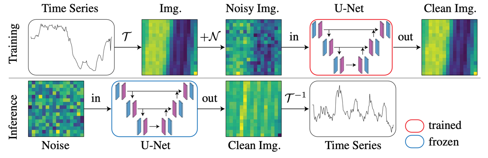

## News
- (September 2024) We are happy to announce that the paper has been accepted to *NeurIPS2024*
- (November 2024) Conditional benchmarking is now available for all datasets.

##  Utilizing Image Transforms and Diffusion Models for Generative Modeling of Short and Long Time Series (ImagenTime)

### [Paper](https://arxiv.org/abs/2410.19538)

## ℹ️ Overview
This project presents a novel approach to generative modeling of time series data by transforming sequences into images. Our method effectively handles both short and long sequences and supports various tasks, including unconditional generation, interpolation, and extrapolation. By leveraging invertible transforms such as delay embedding and the short-time Fourier transform,
 we create a unified framework that processes varying-length time series with high efficiency and accuracy.

We welcome you to use our code and benchmark to develop new methods and applications for time series data.
Our model can serve as a strong baseline for comparison and evaluation of new models.
## Setup
Download and set up the repository:
```bash
git clone https://github.com/azencot-group/ImagenTime.git
cd ImagenTime
```

We provide a [`requirements.yaml`](requirements.yaml) file to easily create a Conda environment configured to run the model:
```bash
conda env create -f requirements.yaml
conda activate ImagenTime
```
## 📊 Data
For your convenience, we provide the data along with the necessary code to load it, all in a single zip file. Please download the zip file from the following here: [`unzip_to_data`](https://drive.google.com/drive/folders/11PXAj0RYei5MyXJVasikmYnEDK6V8awt?usp=share_link)

```
https://drive.google.com/drive/folders/11PXAj0RYei5MyXJVasikmYnEDK6V8awt?usp=share_link
```
Then, unzip the file into the project's empty `/data` folder. That's it! All unzipped datasets are already preprocessed according to the specified protocols.

- **Short datasets**:
  - Unconditional Generation: Energy, MuJoCo, Stocks, Sine.
  - Conditional generation: ETTh1, ETTh2, ETTm1, ETTm2.

- **Long datasets**:
  - Unconditional Generation: FRED-MD, NN5 Daily, Temp Rain.
  - Conditional generation: Physionet, USHCN.

- **Ultra-long datasets**:
  - Unconditional Generation: Traffic, KDD-Cup.
  - Conditional generation: Traffic, KDD-Cup.

If you use these datasets, please cite the sources as referenced in our [paper](https://arxiv.org/abs/2410.19538).

## :rocket: Usage
We include three main scripts to perform different tasks:

- **Unconditional Generation**: [`run_unconditional.py`](run_unconditional.py) - Executes the unconditional generation task.
- **Visualization Metrics**: [`run_visualization.py`](run_visualization.py) - Executes the visualization of various metrics.
- **Conditional Generation**: [`run_conditional.py`](run_conditional.py) - Executes the conditional generation task.

>💡For convenience, we provide configuration files for each task and dataset under the [`./configs`](./configs) directory.

**For Training and Evaluation of Unconditional Generation:**
```bash
python run_unconditional.py --config ./configs/unconditional/<desired_dataset>.yaml
```
**For Training and Evaluation of Conditional Generation:**
```bash
python run_conditional.py --config ./configs/conditional/<interpolation or extrapolation>/<desired_dataset>.yaml
```
**Visualization Metrics (t-SNE, PCA, etc.):**
> Note that the visualization script expects a trained model, so you must run the training scripts first.

```bash
python run_visualization.py --config ./configs/unconditional/<desired_dataset>.yaml
```
## BibTeX
```
@article{naiman2024utilizing,
  title={Utilizing Image Transforms and Diffusion Models for Generative Modeling of Short and Long Time Series},
  author={Naiman, Ilan and Berman, Nimrod and Pemper, Itai and Arbiv, Idan and Fadlon, Gal and Azencot, Omri},
  journal={arXiv preprint arXiv:2410.19538},
  year={2024}
}
```


